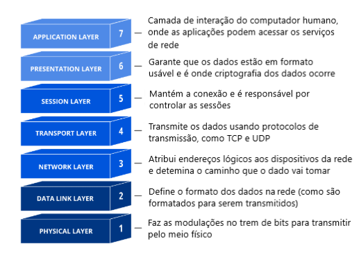
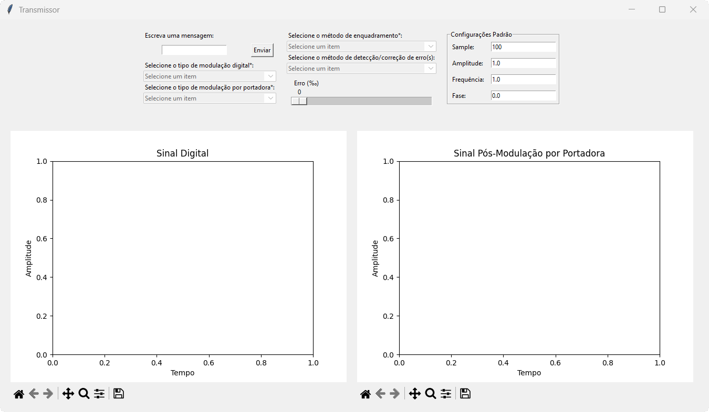
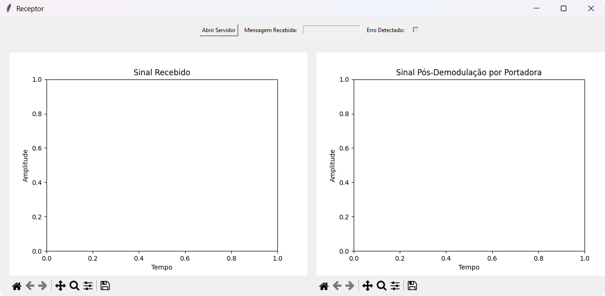

# SimulNet - Projeto de TR1
Esse é o projeto final da matéria Teleinformática e Redes 1 da Universidade de Brasília (UnB) do semestre 2024/2, ministrada pelo professor Marcelo Marotta. Ele foi desenvolvido em Python. Seu funcionamento e técnologias utilizadas são apresentados à seguir.

## Sumário
1. [Preparação](#preparação)
2. [Introdução](#introdução)
3. [Estrutura do Projeto](#estrutura-do-projeto)
4. [Funcionamento do Simulador](#funcionamento-do-simulador)

## Preparação
O primeiro passo para executar a simulação é instalar o [Python](https://www.python.org/). Além dele, serão necessárias algumas de suas bibliotecas. A seguir, apresento essas bibliotecas e como instalá-las.

1. Tkinter: a biblioteca utilizada para interface gráfica

    ```sh
    pip install tk
    ```
2. Matplotlib: a biblioteca usada para construir os gráficos

    ```sh
    pip install matplotlib
    ```
<div align="left">
    
</div>

## Introdução

O modelo OSI (Open Systems Interconnection) é um modelo de referência que descreve as funções de comunicação em redes de computadores. O modelo é dividido em sete camadas, cada uma responsável por funções específicas que garantem a comunicação eficiente entre dispositivos.

<div align="center">
  
</div>

Este relatório descreve a implementação de um simulador que aborda as camadas física e de enlace do modelo OSI. O objetivo principal é simular o funcionamento dessas camadas, incluindo técnicas de modulação digital (NRZ-Polar, Manchester e Bipolar), modulação por portadora (ASK, FSK e 8-QAM), enquadramento de dados (Contagem de Caracteres e Inserção de Bytes), detecção e correção de erros (Bit de Paridade, Código de Redundância Cíclica - CRC e Código de Hamming). O simulador foi desenvolvido em Python, proporcionando uma visão prática dos mecanismos fundamentais que garantem a transmissão eficiente e confiável de dados em redes de computadores.

O problema central a ser resolvido consiste na simulação de um sistema de comunicação que possibilite a transmissão de dados entre dois pontos, considerando os desafios inerentes à presença de ruído e erros de transmissão — simulados no projeto. O simulador deve ser capaz de transmitir e receber dados de forma confiável, aplicando técnicas de modulação, enquadramento, detecção e correção de erros. A comunicação entre os dois pontos é realizada por meio de **sockets**, biblioteca da linguagem Python, onde dois processos distintos — um transmissor e um receptor — interagem para simular a troca de dados em um cenário realista.

## Estrutura do Projeto

O projeto está organizado em uma estrutura de diretórios que facilita a modularidade e a manutenção do código. A seguir, descrevemos a organização dos arquivos e diretórios:
```plaintext
Projeto_TR1
├─── gui
│ ├── transmissor.py
│ └── receptor.py
└─── src
  ├─── transmissor
  │ ├── __init__.py
  │ ├── camada_fisica.py
  │ └── camada_enlace.py
  ├─── receptor
  │ ├── __init__.py
  │ ├── camada_fisica.py
  │ └── camada_enlace.py
  └─── utils
    ├── bytes_to_string.py
    ├── listBool_to_bytes.py
    ├── string_to_bytes.py
    └── text_to_bytes.py
```


- O diretório **gui** contém os arquivos `transmissor.py` e `receptor.py`, que são responsáveis por iniciar a interface gráfica do simulador.
- O diretório **src** contém os módulos `transmissor` e `receptor`, que implementam as funcionalidades da camada física e de enlace do modelo OSI.
- O diretório **utils** contém funções auxiliares que são utilizadas em diferentes partes do projeto.

## Funcionamento do Simulador

Para utilizar o simulador, é necessário executar o arquivo `transmissor.py` em um terminal e o arquivo `receptor.py` em outro. O transmissor exibe uma interface gráfica que permite configurar os parâmetros de modulação por portadora — como o tamanho da amostragem, a frequência, a amplitude e a fase padrão utilizadas para gerar o sinal —, além dos parâmetros de transmissão, como a técnica de modulação, o enquadramento de dados e a detecção de erros. A interface também possibilita a visualização dos sinais gerados após cada etapa de modulação.

Por sua vez, o receptor exibe uma interface gráfica que permite visualizar o sinal recebido e a mensagem decodificada após a demodulação. Além disso, a interface do receptor conta com um botão "Abrir Servidor", que habilita o transmissor a enviar os dados.

Após configurar os parâmetros no transmissor e abrir o servidor no receptor, o usuário deve clicar no botão "Enviar Dados" na interface do transmissor para iniciar a transmissão. Esse processo garante que os dados sejam enviados e recebidos corretamente, permitindo a simulação completa da comunicação entre os dois pontos.

<div align="center">
  
</div>

<div align="center">
  
</div>
